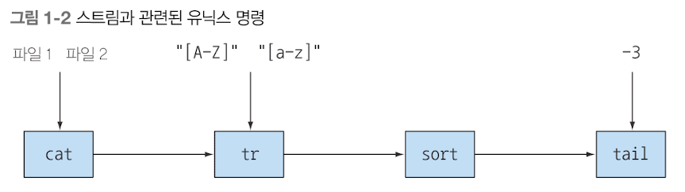

## 스트림 API
### 스트림?
- 한 번에 한 개씩 만들어지는 연속적인 데이터 항목들의 모임
- 프로그램은 
  - 입력 스트림에서 데이터를 한개씩 읽어들인다.
  - 출력 스트림으로 데이터를 한개씩 기록한다.
  - 즉, 어떤 프로그램의 출력 스트림은 다른 프로그램의 입력 스트림이 될 수 있다.

 
- 유닉스에서는 `|(파이프)`를 이용해서 명령을 연결할 수 있는데, 이 또한 스트림이다.
  - `cat file1 file2 | tr "[A-Z]" "[a-z]" | sort | tail -3`
  - 
  - 유닉스에서는 위 명령어를 "병렬"로 실행한다. 따라서, `cat`이나 `tr` 명령어가 완료되지 않은 시점에서, `sort`가 행 처리를 시작할 수 있다.

- Java 8에 추가된 `java.utils.stream`패키지의 `Stream API`
  - 스트림 API는 파이프라인을 만드는 데 필요한 많은 메서드를 제공한다.
  - 스트림 API의 핵심
    - 기존에는 한번에 한 항목씩 처리 -> Java 8에서는 우리가 하려는 작업을 DB의 SQL 질의처럼 고수준으로 추상화하여, 일련의 스트림으로 만들어서 처리
    - 입력 부분을 여러 CPU 코어에 쉽게 할당할 수 있음
    - 스레드를 사용하지 않으면서도 병렬성을 얻을 수 있음
