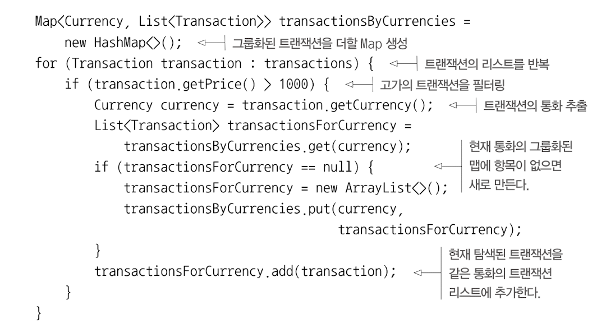
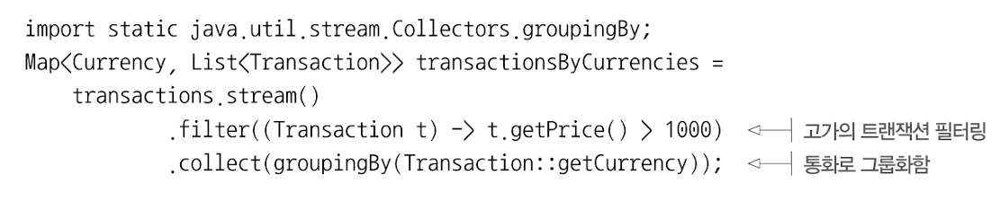
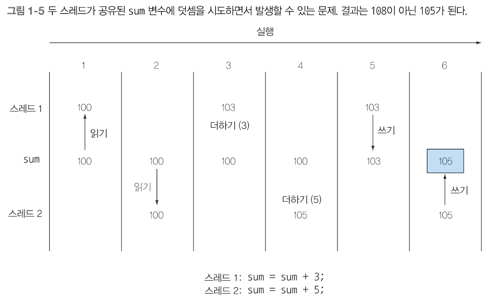
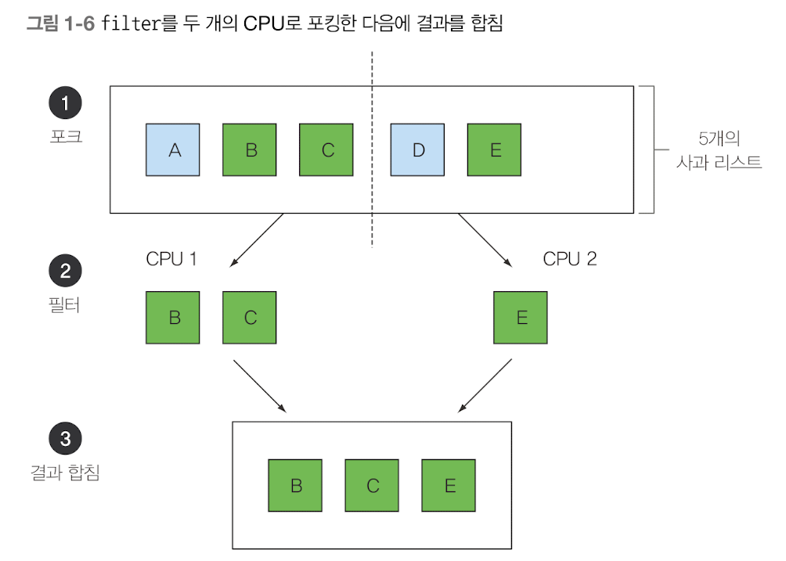

## 스트림
### 긴 말이 필요 없다. 스트림을 사용하는 이유를 예제로 살펴보자.


스트림 사용 전



스트림 사용 후



- 스트림 API를 이용하면, 컬렉션 API와는 상당히 다른 방식으로 데이터를 처리할 수 있다.
  - 컬렉션 : 반복 과정을 직접 처리. for-each 루프를 돌며 각 요소를 반복하면서 작업을 수행 -> "외부 반복"
  - 스트림 : 루프를 신경 쓸 필요 없음. 라이브러리 내부에서 모든 데이터가 처리 됨. -> "내부 반복"


거대한 리스트가 있을 경우, 어떻게 처리해야 할까?
- 단일 CPU로는 힘들다.
- 하지만, 우리에게는 멀티 코어 컴퓨터가 있다. 멀티 코어를 활용해서 병렬로 작업을 수행할 수 있다면, 더 빠르지 않을까?


### 멀티 스레딩은 어렵다!
- 자바 8 이전 버전에서 제공하는 스레드 API로 "멀티 스레딩"코드를 구현해서 병렬성을 이용할 수 있다.
  - 하지만, 이는 매우 어렵다..
- 멀티 스레딩 환경에서
  - 각각의 스레드는 동시에 공유된 데이터에 접근할 수 있다.
  - 또한, 데이터를 갱신할 수 있다.
  - 결론적으로, 스레드를 잘 제어하지 못한다면 **원치 않는 방식으로 데이터가 바뀔 수 있다**




자바 8은 **스트림 API**를 이용하여, 아래와 같은 문제를 해결하였다.
- 컬렉션을 처리하면서 발생하는 모호함과 반복적인 코드 문제
- 멀티 코어 활용 어려움


어떻게 해결했을까?
- 반복되는 패턴을 라이브러리에서 제공
  - 필터링, 추출, 그룹화 등의 기능을 제공함
- 해당 동작들을 쉽게 병렬화할 수 있다.
- 
  - 포킹 단계 : 두 CPU를 가진 환경에서 리스트를 필터링 할 때 아래와 같이 요청할 수 있다.
    - 한 CPU는 리스트의 앞부분을 처리
    - 다른 CPU는 리스트의 뒷부분을 처리
  - 필터 : 각각의 CPU가 자신이 맡은 리스트를 처리한다.
  - 결과 합침 : 하나의 CPU가 두 결과를 정리한다.

- 구글 검색도 이와 같은 방식으로 작동하면서, 빠르게 검색 결과를 제공한다고 함.
  - 물론, 구글 검색은 두개 이상의 프로세서를 사용한다.

- 컬렉션 : 어떻게 데이터를 저장하고 접근할지
- 스트림 : 데이터에 어떤 계산을 할것인지

> 스트림은 스트림 내의 요소를 쉽게 병렬로 처리할 수 있는 환경을 제공한다는 것이 핵심!
> 컬렉션을 필터링할 수 있는 가장 빠른 방법은, 컬렉션을 스트림으로 바꾸고, 병렬로 처리한 다음, 리스트로 다시 복원하는 것이다.

- 순차 스트림 `stream()`
- 병렬 스트림 `parallelStream()`

```text
자바의 병렬성과 공유되지 않은 가변 상태

자바 8은 이를 위한 두 가지 요술방망이를 제공한다.

1. 라이브러리에서 분할을 처리
- 큰 스트림을 병렬로 처리할 수 있도록 작은 스트림으로 분할

2. filter 같은 라이브러리 메서드로 전달된 메서드가 상호작용을 하지 않는다면, "가변 공유 객체"를 통해 공짜로 병렬성을 누릴 수 있다.
- 함수형 프로그래밍에서 함수형이란 "함수를 일급 값으로 사용한다"라는 의미도 있지만,
  부가적으로 "프로그램이 실행되는 동안 컴포넌트 간에 상호작용이 일어나지 않는다"라는 의미도 포함한다.

이게 무슨말일까... 일단은 책을 좀 더 읽어보면 깨달을까..?
-> 아직 이렇다 할 해석을 얻지 못함 ㅠㅠ 더 공부해보자.

> 노가다김씨 님의 해석을 득템하였습니다. 감사의 말씀 올립니다. <
가변 공유객체라고 할지라도, stream.filter, stream.map, stream.reduce 등에 전달되는 파라미터
(여기서는 람다, 메소드레퍼런스따위의 콜백)이 타겟에 변형을 일으키지 않으면(즉, 파라미터 불변임을 확신한다면) 
불변객체와 같은 병렬성을 누릴수 있다는 매우 뻔한 이야기를 하고있습니다.

예를 들어 내가 만든 MyClass에는 Setter가 존재해서 내부 멤버를 수정할수있는 수단을 제공한다고 치고, 
이걸 리스트로 만들었다 가정합시다.

- 이걸 stream.map(e->{e->e.getXXX()}); 만 수행하는 경우는 가변객체라도 문제없음
- 하지만 stream.map(e->e.setXxx()); 요경우는 문제가 되겠죠
```


  