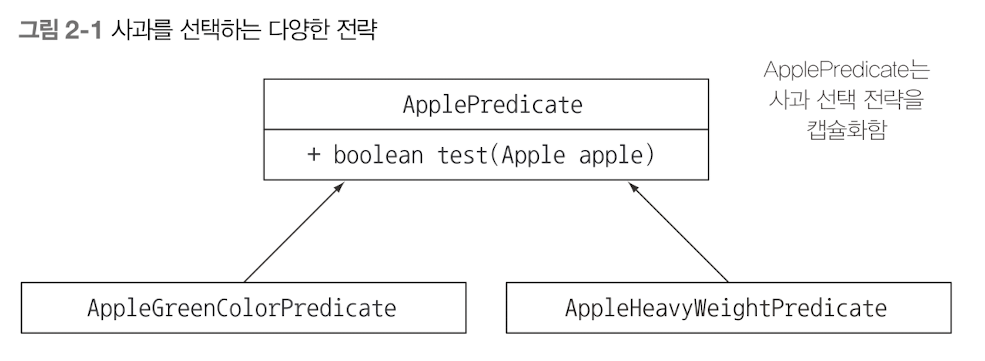

## 변화하는 요구사항에 유연하게 대응하기 위한 규칙
> 거의 비슷한 코드가 반복 존재한다면, 그 코드를 추상화 하라. (DRY, don't repeat yourself)

## 전략 디자인 패턴

- 예제 : chapter_02.Example01_strategyDesignPattern 참고
- 사과의 어떠한 속성에 기초하여 `boolean`값을 반환하는 방법
- 전략 디자인 패턴 ?? 
  - 전략이라 불리는 각 알고리즘을 캡슐화하는 알고리즘 패밀리를 정의하고, (인터페이스를 말하는 것 같다.)
  - 런타임에 알고리즘을 선택하는 기법. (다형성으로 인해 인터페이스를 정의한 전략들은 런타임에 갈아끼울 수 있다.)

위와 같은 전략 디자인 패턴을 이용하면, 조건에 따라 사과를 필터하는 filteredApples 메서드가 아래와 같이 변경에 유연해질 수 있다.
```java
// 결과적으로, 반복하는 로직과, 컬렉션의 각 요소에 적용할 동작이 분리되었다.
// 따라서, filterApples 메서드의 "동작"을 파라미터화 한 것이다. 
List<Apple> filterApples(List<Apple> apples, ApplePredicate applePredicate) {  // 이 부분이 동작 파라미터화 된 것이다!
    List<Apple> filteredApples = new ArrayList<>();
    for (Apple apple : apples) {
        if (applePredicate.test(apple)) {  // 사과 검사 조건이 캡슐화 되었다.
            filteredApples.add(apple);
        }
    }

    return filteredApples;
}
```


## 한개의 파라미터 & 다양한 동작
- 동작 파라미터화를 하게 되면, 로직과 동작을 분리할 수 있게 된다.

## 퀴즈
- chapter_02.Quiz01 참고
