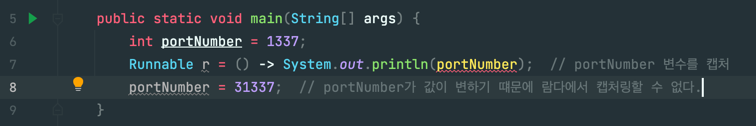

# 형식 검사, 형식 추론, 제약
> *람다로 함수형 인터페이스를 만들 수 있다*

하지만, 람다 표현식 자체에는 람다가 어떤 함수형 인터페이스를 구현하는지의 정보가 포함되어 있지 않다.

어떻게 하는걸까?


## 형식 검사
- 람다가 사용되는 Context를 이용해서 람다의 형식(type)을 추론할 수 있다.
  - Context : 람다가 전달될 메서드 파라미터나, 람다가 할당되는 변수 등을 의미한다.
- 어떠한 Context에서 기대되는 람다의 표현식을 "대상 형식(target type)"이라고 한다.

### 람다 표현식을 사용할 때 발생하는 일
```java
// 시그니처 : filter(List<Apple> a, Predicate<Apple> p)
List<Apple> heavierThan150g = filter(inventory, (Apple apple) -> apple.getWeight() > 150);  // Context 파악
```
위와 같은 코드가 있을 때, 다음과 같은 순서로 형식 확인 과정이 진행된다고 함.
1. `filter` 메서드의 선언 확인
2. `filter` 메서드는 두 번째 파라미터로 `Predicate<Apple>` 형식(**대상 형식**)을 기대함
3. `Predicate<Apple>`은 `test`라는 한 개의 추상 메서드를 정의하는 함수형 인터페이스임.
4. `test`메서드는 `Apple`을 받아 `boolean`을 반환하는 함수 디스크립터를 묘사함.
5. `filter`메서드로 전달된 인수는 이와 같은 요구사항을 만족해야 함. (디스크립터와 람다의 시그니처가 일치해야 함. 디스크립터의 파라미터->반환 형식을 람다의 시그니처도 지켜야 한다.)


## 같은 람다, 다른 함수형 인터페이스
- 대상 형식(target typing)이라는 특징 때문에 같은 람다 표현식이라도, 호환되는 추상 메서드를 가진 다른 함수형 인터페이스로 사용될 수 있다.
- 예시 : `Callable`, `PrivilegedAction` > 인수를 받지 않고, `T`를 반환하는 함수
```java
Callable<Integer> c = () -> 42;
PrivilegedAction<Integer> p = () -> 42;

// 다른 예시. 아래 세 개의 람다식은 동일하지만, 호환되는 추상메서드를 가진 다른 함수형 인터페이스로 사용될 수 있다.
Comparator<Apple> c1 = (Apple a1, Apple a2) -> a1.weight() - a2.weight();
ToIntBiFunction<Apple, Apple> c2 = (Apple a1, Apple a2) -> a1.weight() - a2.weight();
BiFunction<Apple, Apple, Integer> c3 = (Apple a1, Apple a2) -> a1.weight() - a2.weight();
```


## 특별한 void 호환 규칙
- 람다의 바디에 일반 표현식이 있을 때, void를 반환하는 함수 디스크립터와 호환될 수 있다. (파라미터 리스트도 함께 호환되어야 한다.)
```java
Predicate<String> p = s -> list.add(s);  // OK
Consumer<String> b -> s -> list.add(s);  // OK
```


## 형식 추론
- 자바 컴파일러는 람다 표현식이 사용된 콘텍스트(대상 형식)를 이용해서 표현식과 관련된 함수형 인터페이스를 추론한다.
  - 대상 형식을 이용하면 함수 디스크립터를 알 수 있기 때문이다.
  - 결과적으로, 컴파일러는 람다의 시그니처도 추론 가능하며, 람다 표현식의 파라미터 형식에 접근할 수 있기 때문에 람다 문법에서 이를 생략할 수 있다.
  - 즉, 자바 컴파일러는 다음처럼 람다 파라미터 형식을 추론할 수 있다.
```java
List<Apple> greenApples = filter(inventory, apple -> GREEN == apple.color());  // 제네릭스를 보고 타입 추론.
Comparator<Apple> c = (a1, a2) -> a1.weight() - a2.weight();  // 제네릭스를 보고 타입 추론.
```


## 지역 변수 사용
- 람다 표현식은 "자유 변수(파라미터로 넘겨진 변수가 아닌 외부에서 정의된 변수)"를 활용할 수 있다.
- 이와 같은 동작을 "람다 캡처링"이라고 부른다.
```java
int portNumber = 1337;
Runnable r = () -> System.out.println(portNumber);  // portNumber 변수를 캡처
```
- 자유 변수에도 제약은 있음
  - 람다는 인스턴스 변수와 정적 변수를 자유롭개 캡처하여 자신의 바디에서 참조할 수 있음
  - 하지만, 그러기 위해서는 명시적으로 final 선언이 되어있거나, 실질적으로 final로 선언된 변수와 똑같이 사용되어야 함.
  - 즉, 람다 표현식은 한 번만 할당할 수 있는 지역 변수를 캡처할 수 있다. (아래의 예시처럼, final이 아닌 변수는 컴파일 에러가 발생한다.)
  - 

### 왜 지역변수에 제약이 있을까?
> *인스턴스 변수와 지역 변수는 태생부터 다르다*
- 인스턴스 변수는 힙에 저장된다.
- 지역 변수는 스택에 위치한다.

람다에서 지역 변수에 바로 접근할 수 있다고 가정 해보자. 

람다가 스레드에서 실행될 경우, 변수를 할당한 스레드가 사라져서 변수 할당이 해제되었는데도 불구하고 람다를 실행하는 스레드에서는 해당 변수에 접근하려고 시도할 수도 있다.

따라서, 자바 구현에서는 원래 변수에 접근을 허용하지 않고 "자유 지역 변수의 복사본"을 제공한다. (call by value 얘기하는듯)

따라서, 복사본의 값이 바뀌지 않아야 하므로 지역 변수에는 한 번만 값을 할당해야 한다는 제약이 생긴 것이다.

또한, 지역 변수의 제약으로 인해 외부 변수를 변화시키는 일반적인 명령형 프로그래밍 패턴(병렬화를 방해하는 요소이다.)에 제동을 걸 수 있다.


### 이게 대체 무슨말이요...
[좀 더 알아보기 위해, 글을 몇개 검색해봤다. 그 중 가장 이해가 잘됐던 글을 소개한다.](https://cobbybb.tistory.com/19)
다시 한번 정리해보자.
```java
int portNumber = 1337;
Runnable r = () -> System.out.println(portNumber);  // portNumber 변수를 캡처
portNumber = 999; // 컴파일 에러!!
```
1. `main`스택이 시작된다.
2. `int portNumber = 1337`이 스택에 쌓인다.
3. `lambda`식이 새로운 스택을 만든다. (스레드 생성)
4. `main`스택 내의 변수들을 자신의 스택에 복사하여 들고있게 된다. -> 스택에 있기 때문에 참조는 된다. 하지만, 변수 값을 수정 할수는 없다.
5. 람다의 스택이 여전히 존재하고, 그 스택 위에서 `portNumber`값을 변경하게 되면, 해당 변수 값이 `main`스레드로 다시 돌아갈 방법이 없기 때문에, 에러가 발생하는 것이다.

### 이러한 일이 발생하는 근본적인 원인, "람다 캡처링"
> 람다 캡처링이란, 기존 메소드의 스택 변수들에 대해 참조가 가능하도록, 람다의 스택에 복사하는 과정을 의미함

- 람다의 스택에 똑같이 복사해와서 사용한다. (변수도 값도)
- 때문에, 람다의 스택에서 값을 변경하더라도, 기존 스택의 값은 변경할 수 없게 된다.
- 이를 컴파일 단계에서 error를 내줌으로써 방지한다.
- 다만, `heap`메모리에 올라와있는 객체들은 수정할 수 있는데, heap에 올라가있는 데이터값을 변경하더라도, 스택에 영향을 주지 않기 때문이다.
  - 하지만, 객체를 참조하고 있는 참조 변수의 주소값을 `null`로 바꾸는 등, 주소값을 바꾸는 행위를 시도하면 위와 같은 컴파일 에러가 발생한다.

> 이 외의 글  
> - [스택 오버 플로우](https://stackoverflow.com/questions/34865383/variable-used-in-lambda-expression-should-be-final-or-effectively-final)
> - [공식 문서](https://docs.oracle.com/javase/specs/jls/se10/html/jls-15.html#jls-15.27.2)
> - 공식 문서에 따르면, 람다 캡처링이 동시성 문제를 일으킬 수 있기 때문에 방지한 거라고 설명이 되어 있다.

- 람다가 정의된 메서드의 지역 변수값은 final이어야 한다.
- 지역 변수값은 스택에 존재하기 때문에, 자신을 정의한 스레드와 생존을 같이해야 한다. -> 따라서 지역 변수는 final이어야 람다에 사용할 수 있다.
- 가변 지역 변수를 새로운 스레드에서 캡처가 가능하도록 설계한다면, 안전하지 않은 동작을 수행할 가능성이 생긴다.
- 인스턴스 변수는 여러 스레드가 공유하는 heap에 존재하기 때문에, 특별한 제약이 없다.


## 클로저
> 람다는 클로저 정의에 부합할까?
- 클로저란? [참고 자료](https://futurecreator.github.io/2018/08/09/java-lambda-and-closure/)
  - 함수의 비지역 변수를 자유롭게 참조할 수 있는 함수의 인스턴스
  - 내부 함수가 외부 함수의 context에 접근할 수 있는 것
  - 람다 : 외부에 의존성이 없다. 
  - 클로저 : 외부에 의존성이 있다.
```java
public class _05_Example {

    private int b = 2;

    private Stream<Integer> calculate(Stream<Integer> stream, Integer a) {
//        a = 10;  // 변경 불가
        return stream.map(t -> t * a + b);  // 내부에서 외부의 a, b를 참조하고 있음. a, b는 컴파일러가 final로 간주.
    }
    
  public static void main(String[] args) {
    // 클로저
    List<Integer> list = List.of(1, 2, 3, 4, 5);
    _05_Example example = new _05_Example();
    List<Integer> result = example.calculate(list.stream(), 3)
            .collect(Collectors.toList());

    System.out.println(result);

    // Lambda.
    (server) -> server.isRunning();  // 람다 파라미터 참조

    // Closure. 외부의 server 라는 변수를 참조
    () -> server.isRunning();  // 외부 변수 참조
  }
```