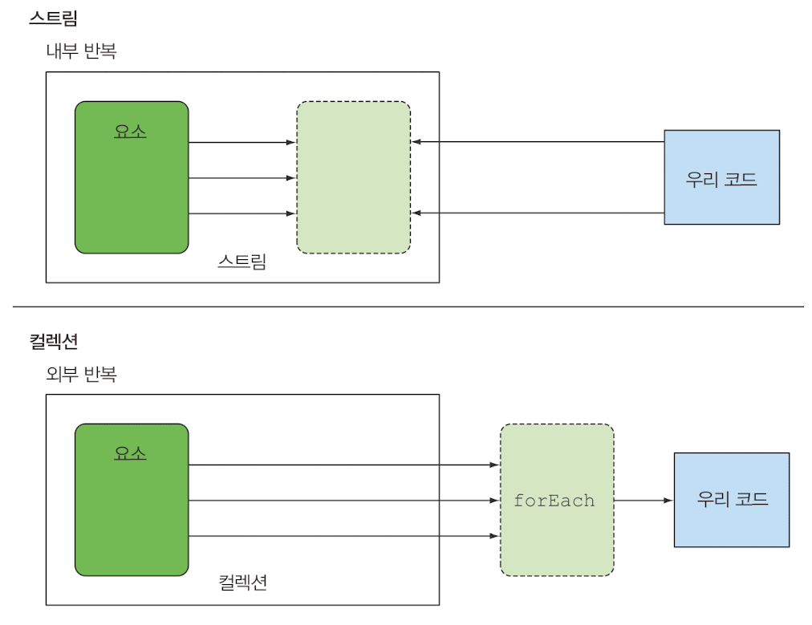

# 스트림과 컬렉션
- 컬렉션과 스트림 모두 "연속된 요소 형식의 값을 저장하는 자료구조의 인터페이스"를 제공한다.
- 연속된(sequenced)
  - 순서와 상관 없이 아무 값에나 접속하는 게 아닌, "순차적으로 값에 접근한다는 것"을 의미함

## 차이점
### 시각적 차이
- DVD : 컬렉션
- 인터넷 스트리밍 : 스트림
- 데이터를 **언제 계산하느냐**가 컬렉션과 스트림의 가장 큰 차이점이다.
  - 컬렉션 : 현재 자료구조가 포함하는 모든 값을 메모리에 저장. -> 컬렉션의 모든 요소는 컬렉션에 추가되기 전에 계산되어야 함.
    - 요소를 추가하거나 삭제할 수 있음
    - 적극적으로 생성 됨 (모든 값을 계산할 때 까지 기다린다는 의미!)
  - 스트림 : **요청할 때만 요소를 계산**하는 고정된 자료구조
    - 요소를 추가하거나 삭제할 수 없음
    - 사용자가 요청하는 값만 스트림에서 추출한다.
    - 생성자-소비자 관계를 형성한다.
    - 사용자가 요청할 때만 값을 계산한다.(Lazy. 값이 필요할 때만 계산한다는 의미!)

### 딱 한 번만 탐색할 수 있다
- iterator, stream 모두 딱 한번만 탐색할 수 있다.
- 탐색된 스트림의 요소는 소비된다.
- 재탐색하려면, 초기 데이터 소스에서 새로운 스트림을 만들어야 한다.
  - 이는 반복 사용할 수 있는 데이터 소스만 가능하다.
  - I/O 채널이라면, 반복 사용이 불가능하기 때문에 새로운 스트림을 만들 수 없다.

### 외부 반복 vs 내부 반복

- 컬렉션 : 인터페이스를 사용하려면 사용자가 직접 요소를 반복해야 함.
  - 이를 **외부 반복** 이라고 한다.
  - 병렬성을 **스스로 관리** 함. (병렬성 포기 or `synchronized`)

- 스트림 : 반복을 알아서 처리하고, 결과 스트림 값을 어딘가에 저장해 줌.
  - 이를 **내부 반복** 이라고 한다.
  - 내부 반복을 이용하면, 작업을 투명하게 병렬로 처리하거나, 더 최적화된 다양한 순서로 처리할 수 있음.
  - 데이터 표현과, 하드웨어를 활용한 병렬성 구현을 자동으로 선택 함.
