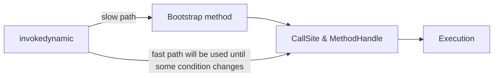

# 람다와 JVM 바이트코드
## 익명 클래스 
- 람다 표현식은 함수형 인터페이스의 추상 구현을 제공한다.

### 익명 클래스는 애플리케이션 성능에 악영향을 주는 특성을 포함한다
- 컴파일러는 익명 클래스에 대응하는 새로운 클래스 파일을 생성한다 
- 익명 클래스는 `ClassName$1`과 같은 파일명을 갖는다.
  - `ClassName` : 익명 클래스를 포함하는 클래스의 이름 
  - 클래스 파일을 사용하기 위해서는 각각의 클래스를 로드하고 검증하는 과정이 필요하다.
  - 따라서, 애플리케이션 스타트업 성능에 악영향을 미친다.

### 새로운 익명 클래스는 클래스나 인터페이스의 새로운 서브타입을 만든다
- `Comparator`를 표현하는 수백 개의 람다가 있다면, 결국 수백 가지의 `Comparator` 서브타입이 생긴다는 의미다.
- 이와 같은 상황에서는 JVM이 런타임 성능을 개선하기 어려울 수 있다.


## 바이트코드 생성 
- 자바 컴파일러는 자바 소스 파일을 자바 바이트코드로 컴파일한다.
- JVM은 생성된 바이트코드를 실행하면서 애플리케이션을 동작시킨다.
```text
 0: aload_0
 1: invokespecial #1                  // Method java/lang/Object."<init>":()V
 4: aload_0
 5: new           #2                  // class modern_java/appendix/InnerClass$1
 8: dup
 9: aload_0
10: invokespecial #3                  // Method modern_java/appendix/InnerClass$1."<init>":(Lmodern_java/appendix/InnerClass;)V
13: putfield      #4                  // Field f:Ljava/util/function/Function;
```
- `new`라는 바이트코드 연산으로 `InnerClass$1`이라는 객체 형식을 인스턴스화 
  - 동시에 새로 생성한 객체 참조를 스택으로 푸시
- `dup`연산은 스택에 있는 참조를 복제함 
- 객체를 초기화하는 `invokespecial`명령어로 값을 소비함 
- 스택의 top에는 여전히 객체 참조가 있으며, `putfield`명령어로 객체 참조를 `LambdaBytecode`의 f1 필드에 저장한다.

즉, 익명 클래스는 컴파일 하면 새로운 클래스 파일들을 만든다.

## 구원투수 InvokeDynamic
람다식의 바이트 코드를 보자.

```text
 0: aload_0
 1: invokespecial #1                  // Method java/lang/Object."<init>":()V
 4: aload_0
 5: invokedynamic #2,  0              // InvokeDynamic #0:apply:()Ljava/util/function/Function;
10: putfield      #3                  // Field f:Ljava/util/function/Function;
13: return
```
- 람다 표현식은 익명 내부 클래스와는 다른 방식으로 컴파일된다.
- 추가적으로, 클래스를 생성하는 부분이 `invokedynamic`이라는 명령어로 대치되었음을 확인할 수 있다.
  - `invokedynamic`을 이용하여 람다 표현식을 바이트코드로 변환하는 작업을 런타임까지 고의로 지연할 수 있다.
- 장점
  - 람다 표현식의 바디를 바이트코드로 변환하는 작업이 독립적으로 유지 됨.
    - 변환 작업이 동적으로 바뀌거나, 나중에 JVM 구현에서 이를 더 최적화 하거나 변환 작업을 고칠 수 있음 
    - 독립적이기 때문에 바이트코드의 과거버전 호환성을 염려할 필요가 없음
  - 람다 덕분에 추가적인 필드가 정적 초기자 등의 오버헤드가 사라짐 
  - 상태 없는(캡처하지 않는) 람다에서 람다 객체 인스턴스를 만들고, 캐시하고, 같은 결과를 반환할 수 있음.
  - 람다를 처음 실행할 때만 변환과 결과 연결 작업이 실행됨
    - 추가적인 성능 비용이 들지 않음
    - 두 번째 호출부터는 이전 호출에서 연결된 구현을 바로 이용할 수 있음 


---
# 다른 자료들..
## InvokeDynamic이란?
> invokedynamic
> - JVM의 동적 형식 언어를 지원할 수 있도록, JDK7에서 추가된 명령어 
> - 해당 명령어는 메서드를 호출할 때, 더 깊은 수준의 재전송과 동적 언어에 의존하는 로직이 대상 호출을 결정할 수 있는 기능을 제공한다. 
> - `def add(a, b) { a + b }` 예제를 보자
>   - 컴파일 할 때, a와 b의 타입을 알 수 없는 데다가, 시간에 따라 a와 b의 타입이 달라질 수 있다.
>   - 위 예제는 실제 호출할 메서드를 결정하는 "언어 종속적 로직"을 구현하는 부트스트랩 메서드의 형태로 구성된다. 
>   - 부트스트랩 메서드는 연결된 call site를 반환한다.
>   - 두 개의 int로 add 메서드를 호출하면 이후로 이어지는 호출에도 두 개의 int가 전달된다.
>   - 결과적으로 매 호출마다 호출할 메서드를 다시 찾을 필요가 없다.
>   - call site는 언제 호출 연결을 다시 계산해야 하는지 정의하는 로직을 포함할 수 있다.

[이 문서에 따르면 ](https://www.baeldung.com/java-invoke-dynamic) 람다식은 익명의 내부 클래스 대신 특별한 정적 메서드를 생성하며, `invokedynamic`을 통해 해당 메서드를 호출한다고 한다.

자바 7 이전에는, JVM에 네 가지 메서드 호출 유형만 존재했다.
- `invokevirtual` : 일반 클래스 메서드 호출 
- `invokestatic` : 정적 메서드 호출
- `invokeinterface` : 인터페이스 메서드 호출
- `invokespecial` : 생성자 또는 비공개 메서드 호출 

위 메서드 호출 유형들은 한 가지 특성이 있는데, 각 메서드 호출을 완료하기 위해 **미리 정의된 몇 가지 일련의 단계**가 존재한다는 것이다. 이는 사용자가 변경할 수 없었다. 

이러한 제한점에 대한 두 가지의 주요 해법이 있다.
- 컴파일 타임 : 스칼라, 코틀린과 같은 언어에서 사용됨
  - 일반적으로 컴파일타임의 코드 생성에 의존 
  - 해당 접근 방식은 런타임에 더 효율적이다.
  - 다만, 깨지기가 쉽고(아마 망가지기 쉽다는 것 같음) 처리할 바이트 코드가 많아져 스타트업이 느려질 수 있음 
- 런타임 : JRuby와 같은 JVM 기반 동적 언어를 위해 사용됨 
  - `reflection`을 이용하기 때문에, 비효율적임

## Under the Hood(내부적으로 이렇게 동작하고 있다는 뜻)

- JVM이 처음으로 `invokedynamic opcode`를 볼 때 부트스트랩 메서드라는 특수 메서드를 호출하여 호출 프로세스를 초기화 
- 부트스트랩 메서드가 정상적으로 완료되면 `CallSite`인스턴스를 반환함. 해당 인스턴스에는 아래의 정보가 있음
  - **JVM이 실행해야 하는 실제 로직**에 대한 포인터. 이는 `MethodHandle`에 대한 holder이다.
    - CallSite에 연결된 invokedynamic 명령어는 모든 호출을 현재 target에 위임한다. 
    - 여러 개의 invokedynamic 명령어와 연결되거나, 아무 것도 연결되지 않은 "free floating"형태일 수 있다.
  - 반환된 `CallSite`의 유효성을 나타내는 condition을 포함한다.


- 첫 번째 호출 후에는 JVM이 특정 opcode를 다시 볼 때마다, slow path를 건너 뛰고 fast path를 통해 기본 실행 파일을 직접 호출함 
  - JVM은 `CallSite`의 조건이 변경될 때 까지 slow path를 계속 건너뛴다.
    

## BootStrap Method Table
```text
14: invokedynamic #23,  0  // InvokeDynamic #0:test:()Ljava/util/function/Predicate;
```
- 위 명령어는 부트스트랩 메서드 테이블에서 첫 번째 부트스트렙 메서드(#0 부분)를 호출해야 한다는 뜻이다.
  - 부트스트랩 메서드에 전달해야 할 몇 가지 인수들도 언급하고 있다.
  - `test`는 오직 `Predicate`의 추상 메서드여야 한다.
  - `()Ljava/util/function/Predicate`부분은 JVM 내에서의 메서드 시그니처를 나타낸다. -> 메서드는 아무것도 입력받지 않으며, Predicate 인터페이스의 인스턴스를 반환함 

### 람다의 바이트코드 
```text
javap -c -p -v Main
// truncated
// added new lines for brevity
BootstrapMethods:
  0: #55 REF_invokeStatic java/lang/invoke/LambdaMetafactory.metafactory:
    (Ljava/lang/invoke/MethodHandles$Lookup;
     Ljava/lang/String;
     Ljava/lang/invoke/MethodType;
     Ljava/lang/invoke/MethodType;
     Ljava/lang/invoke/MethodHandle;
     Ljava/lang/invoke/MethodType;)Ljava/lang/invoke/CallSite;
    Method arguments:
      #62 (Ljava/lang/Object;)Z
      #64 REF_invokeStatic Main.lambda$main$0:(Ljava/lang/String;)Z
      #67 (Ljava/lang/String;)Z
```
- 모든 람다의 부트스트랩 메서드는 LambdaMetafactory 클래스의 metafactory static method이다.
- 해당 메서드는 최소한 세 가지의 인수를 취한다.
  - `Ljava/lang/invoke/MethodHandles$Lookup`: invokedynamic을 위한 lookup context를 의미함.
  - `Ljava/lang/String` : call site 내의 메서드 이름을 의미함 (해당 예제에서의 메서드 이름은 `test`임)
  - `Ljava/lang/invoke/MethodType` : call site의 dynamic method signature를 의미함 (위 예제의 경우 `()Ljava/util/function/Predicate`임)
- 부트스트랩 메서드는 하나 이상의 추가 매개 변수를 허용할 수 있음 
  - `(Ljava/lang/Object;)Z` : Object의 인스턴스를 받고, boolean을 반환하는 erased method signature (아마 제네릭을 말하는듯)
  - `REF_invokeStatic Main.lambda$main$0:(Ljava/lang/String;)Z` : 실제 lambda logic을 가리키는 MethodHandle
  - `(Ljava/lang/String;)Z ` : String을 받아 boolean을 반환하는 non-erased method signature 

요약하자면 아래와 같다.
- JVM이 필요한 모든 정보를 부트스트랩 메서드에 전달
- 부트스트랩 메서드는 해당 정보를 사용하여 적절한 인스턴스를 생성 
- JVM이 해당 인스턴스를 호출한 메서드에게 전달


## Different Types of CallSties
위 예제에서 JVM은 아래와 같이 동작함.
- JVM이 `invokedynamic`확인후 부트스트랩 메서드 호출
- 부트스트랩 메서드가 `InnerClassLambdaMetafactory`를 사용하여 런타입에 람다용 내부 클래스 생성 
- 부트스트랩 메서드가 생성된 내부 클래스를 `ConstantCallSite`라고 하는 특별한 유형의 `CallSite` 내부에 캡슐화 함 
- 해당 유형의 `CallSite`는 설정 후 절대 변경되지 않기 때문에, 각 람다에 대한 첫 설정이 완료되면 JVM은 fast path를 통해 람다 로직을 직접 호출하게 된다. 


## Advantages 
- 람다 식을 구현하기 위해, 자바는 컴파일 타임에 익명의 내부 클래스를 생성하는 대신, 런타임에 `invokedynamic`을 통해 생성한다. 
- 장점
  - JVM은 람다를 처음 사용할 때 까지 내부 클래스를 생성하지 않음. (lazy)
  - `linkage logic` 대부분이 바이트 코드에서 부트스트랩 메서드로 이동 됨
    - 일반적으로 다른 solition들에 비해 훨씬 작다. -> 더 작은 바이트 코드는 스타트업 속도를 높인다!
  - 최신 버전의 Java가 더 효율적인 부트스트랩 메서드 구현과 함께 제공된다고 가정한다면...
    - `invokedynamic` 바이트 코드는 재 컴파일 하지 않아도, 개선된 사항을 활용할 수 있다. 
    - 재 컴파일 없이 다른 전략 간에 전환을 할 수 있게 됨으로써, 포워딩 바이너리 호환성을 달성할 수 있다.


> `invokedynamic`은 람다 뿐만 아니라 record와 같은 타입에도 사용된다.
> - record는 toString, equals, hashcode를 구현하지 않아도 사용할 수 있는 타입인데, JVM이 invokedynamic을 이용해 이를 동적으로 만들어주기 떄문에 가능한 일이다.
> 
> 또한, `String concatenation`에도 사용된다.


### MethodHandle
- 기본 메서드, 생성자, 필드 또는 similar low-level operation에 대한 유형이 지정되고, 직접 실행 가능한 reference이며, 인수 또는 반환 값에 대한 선택적인 변환이 있음 
- 즉, 메서드를 찾고, 적용하고, 호출하기 위한 low-level 메커니즘임
- 메서드 핸들은 변경할 수 없으며, visible state가 없음.
- 아래와 같은 스텝으로 만들고 사용할 수 있다.
  - lookup 생성
  - method type 생성
  - 메서드 핸들 조회 
  - 메서드 핸들 호출(invoke)
- 실행 시간이 아닌 생성 시간에 access 확인이 이뤄짐 -> Reflection API보다 훨씬 빠를 수 있음 
- 메서드 커링 가능 / 매개변수 타입 변경 가능 / 순서 변경 가능 


### JVM과 부트스트랩 메서드
[JVM에 대해서 간단하게 알아보기](https://tecoble.techcourse.co.kr/post/2021-07-15-jvm-classloader/)

[부트스트랩 메서드?](https://stackoverflow.com/questions/30733557/what-is-a-bootstrap-method)
- `invokedynamic`은 JVM 내에서 임의의 메서드를 호출하는 데 사용되는 바이트코드 operation이다.
- 호출 및 실행 될 메서드는 컴파일 타임에 정확히 알 수 없다.
- 이는 `CallSite`를 구현하는 객체에 의해 계산된다.
  - `CallSite`객체는 다른 객체들과 마찬가지로 인스턴스화 되어야 한다.
  - `BootStrap`메서드는 `CallSite` 객체를 **인스턴스화 하는 메서드**이다.
- 각 `invokedynamic`에는 컴파일 타임 매개변수로 지정된 `bootstrap method`가 있음 
  - `invokedynamic`이 처음으로 처리될 때 마다 적절한 부트스트랩 메서드가 호출 됨 
  - 부트스트랩 메서드 실행 결과 `CallSite`객체가 생성 됨 
  - 해당 객체는 JVM에 의해 캐시되고, 지정된 `invokedynamic`작업에 연결 됨 
  - 특정 `invokedynamic`이 호출될 때 마다 캐시된 `CallSite` 인스턴스가 호출된 메서드를 resolve하는 데 사용 됨
- 부트스트랩 메서드는 소스 내에서 특정 Java 구문이 사용될 때마다 javac 컴파일러에 의해 생성 됨
  - String concatenation or lambda expression
- 람다 식은 내부 클래스로 구현될 수 있으나, 성능 상의 이유로 정적 메서드 형태로 람다 코드를 생성하고, `invokedynamic`을 사용하여 이 메서드를 호출해 내부 클래스 생성을 회피함 


