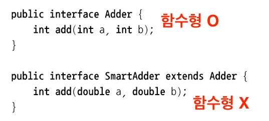

> *람다 표현식은 함수형 인터페이스라는 문맥에서 사용될 수 있다.*

## 함수형 인터페이스

- 오직 하나의 추상 메서드만 지정하는 인터페이스 (디폴트 메서드랑은 상관 없다. 오직 추상 메서드만 따짐.)
  - ex: `Predicate<T>`, `Comparator<T>`, `Runnable<T>` ...
- 람다 표현식으로 함수형 인터페이스의 추상 메서드 구현을 직접 전달할 수 있다.
  - 전체 표현식을 함수형 인터페이스의 인스턴스로 취급한다. (함수형 인터페이스를 구현한 클래스의 인스턴스를 의미)
  - 예제 : chapter_03._01_RambdaEx

## 함수 디스크립터
- 함수형 인터페이스의 추상 메서드 시그니처는 "람다 표현식의 시그니처"를 가리킨다. 즉, 서로 시그니처가 일치해야 한다. (파라미터, 반환값 등)
- "함수 디스크립터(function descriptor)"는 람다 표현식의 시그니처를 서술하는 메서드이다.
  - ex : `Runnable`의 유일한 추상 메서드 `run`은 인수와 반환 값이 없다. == `Runnable` 인터페이스는 인수와 반환값이 없는 시그니처이다.
  - `() -> void`는 파라미터 리스트가 없고, void를 반환하는 함수이다. (한 개의 void 메서드 호출은 중괄호가 필요 없다.)
  - `(Apple, Apple) -> int`는 두개의 Apple을 인수로 받아 int를 반환하는 함수이다.
- 특징
  - 변수에 할당하거나, 함수형 인터페이스를 인수로 받는 메서드로 전달할 수 있다.
  - 함수형 인터페이스의 추상 메서드와 같은 시그니처를 갖는다.

