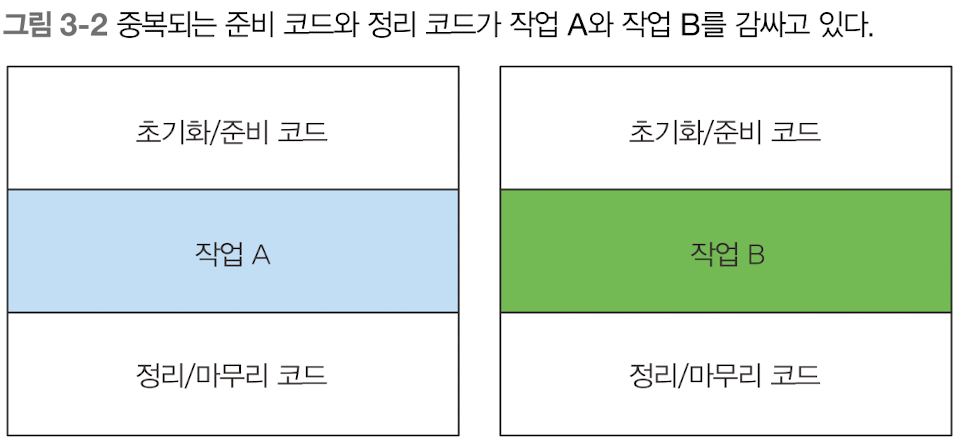

## 람다 활용 | 실행 어라운드 패턴
- 자원 처리에 사용하는 순환 패턴
    - 자원을 열고, 처리한 다음, 자원을 닫는 순서로 진행
    - 설정과 정리 과정은 대부분 비슷하다. -> 실제 자원을 처리하는 코드를, 설정과 정리 두 과정이 둘러싸는 형태를 가짐.
 
    
#### 실행 어라운드 패턴 예시

```java
public String processFile() throws IOException {

    try (BufferedReader br = new BufferedReader(new FileReader("data.txt"))) {
        return br.readLine();  // 실제 필요한 작업을 수행    
    }
}
```

위의 메서드를 유연하게 바꿔보자.

1. 동작 파라미터화
- processFile()메서드로 동작을 전달해보자.
- 한번에 두 행을 읽게 하려면 아래와 같이 바꿔야 한다. (BufferedReader를 인수로 받아서 String을 반환하는 람다 필요)
```java
processFile((BufferedReader br) -> br.readLine() + br.readLine())
```

2. 함수형 인터페이스를 만들어서 동작 전달
- 함수형 인터페이스 자리에 람다를 사용할 수 있으므로, BufferedReader -> String과 IOException을 던질 수 있는 시그니처와 일치하는 함수형 인터페이스를 만들어야 한다.
```java
@FunctionalInterface
public interface BufferedReaderProcessor {
    String process(BufferedReader br) throws IOException;
}

public String processFile(BufferedReaderProcessor p) throws IOException {

}
```

3. 동작 실행
```java
public static void main(String[] args) throws IOException {
    // BufferedReader가 process()메서드에 전달됐을 때, 어떻게 행동할 것인지를 정의!
    // 해석 : 파라미터에 BufferedReader가 넘어왔을 때, br.readLine() + br.readLine()을 수행한다는 의미이다.
    String strForLambda = processFile((BufferedReader br) -> (br.readLine() + br.readLine()));  // 람다식 전달.
    System.out.println(strForLambda);

    String strForAbstractMethod = processFile(new BufferedReaderProcessor() {
        @Override
        public String process(BufferedReader br) throws IOException {
            return br.readLine() + br.readLine();
        }
    });
}

@FunctionalInterface
public interface BufferedReaderProcessor {
    String process(BufferedReader br) throws IOException;
}

public static String processFile(BufferedReaderProcessor p) throws IOException {
    try (BufferedReader br = new BufferedReader(new InputStreamReader(System.in))) {  // 실제로 메서드 내부에서 BufferedReader 인스턴스를 process()에 넘겨줬을 때,
        return p.process(br);  // 람다에서 정의한 행동을 수행하고, String을 반환한다.
    }
}
```