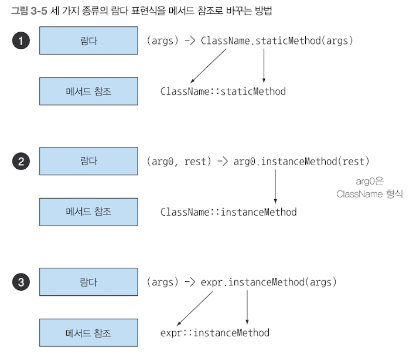

# 메서드 참조

```java
// 사용 예시
inventory.sort(comparing(Apple::getWeight));
```
- 기존의 메서드 정의를 재활용해서 람다처럼 전달하는 방법
- 특정 메서드만을 호출하는 람다의 축약형 (람다를 편리하게 표현할 수 있는 문법)
- 가독성을 높일 수 있음
- `Apple::getWeight` : Apple 클래스의 getWeight에 대한 메서드 참조

## 메서드 참조 만들기

### 정적 메서드 참조
- `Integer.parseInt()` -> `Integer::parseInt`


### 다양한 형식의 인스턴스 메서드 참조
- `"어떠한 스트링".length()` -> `String::length`
- `(String s) -> s.toUpperCase()` -> `String::toUpperCase()`


### 기존 객체의 인스턴스 메서드 참조
- `modern_java.Transaction`객체를 할당 받은 `expensiveTransaction` 지역 변수가 있고
  - `modern_java.Transaction`이라는 객체에는 `getValue()` 메서드가 있다면
  - 이를 `expensiveTransaction::getValue`로 표현할 수 있다.
  - `() -> expensiveTransaction.getValue()` -> `expensiveTransaction::getValue`
- 해당 유형의 메서드 참조는 "비공개 헬퍼 메서드를 정의한 상황"에서 유용하게 사용될 수 있다!
```java
// 객체 내부에서 사용하는 헬퍼 메서드
private boolean isValidName(String string) {
    return Character.isUpperCase(string.charAt(0));
}

// 객체 내부에서 다음과 같이 메서드 참조 형식으로 사용할 수 있다.
public filter(Predicate<String> predicate) {}

public static void main(String[]args){
    filter(words, this::isValidName);        
}
```


### 이 외에도..
- 생성자, 배열 생성자, super 호출 등에 사용할 수 있는 특별한 형식의 메서드 참조도 있다.


### 예제
```java
List<String> str = List.of("a", "b", "A", "B");
str.sort((s1, s2) -> s1.compareToIgnoreCase(s2));

// 아래와 같이 변경된다.
str.sort(String::compareToIgnoreCase);
```


### 컴파일러는 메서드 참조를 어떻게 확인하나?
- 람다 표현식의 형식을 검사하던 방식과 비슷한 과정으로 확인한다.
  - 메서드 참조가 주어진 함수형 인터페이스와 호환되는지 확인
  - 즉, 메서드 참조는 콘텍스트 형식과 일치해야 함
