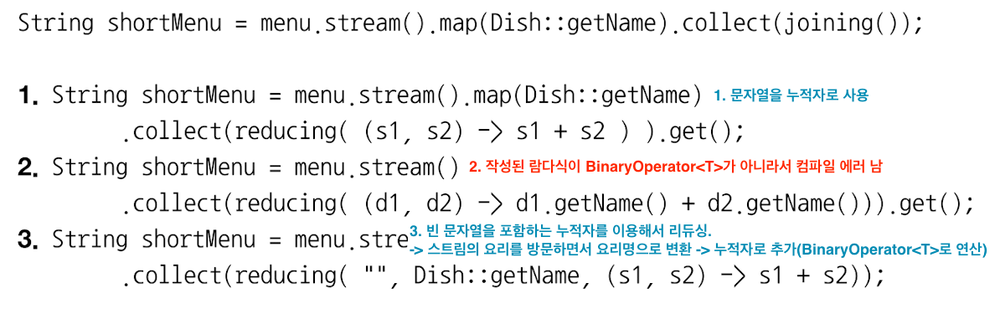

# 리듀싱과 요약
- 컬렉터로 스트림의 모든 항목을 하나의 결과로 합칠 수 있다.
  - Map, Integer, int ...

### 리듀싱
- counting, maxBy, minBy

### 요약
- 합계, 평균 등을 반환

### collect와 reduce
- collect : 도출하려는 결과를 누적하는 컨테이너를 바꾸도록 설계 됨
- reduce : 두 값을 하나로 도출하는 불변형 연산
  - 누적자를 변환시키면 안됨.

### Quiz

> 예제 : chapter_06._02_Example 참고 

