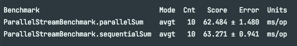
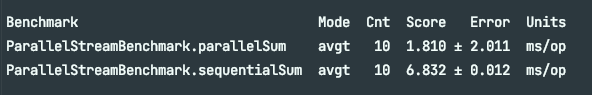

## 병렬 스트림이란?
- 각각의 스레드에서 처리할 수 있도록 스트림 요소를 여러 청크로 분할한 스트림
- 병렬 스트림을 활용하면 모든 멀티코어 프로세서가 각각의 청크를 처리하도록 할당할 수 있음


## 병렬 스트림에서의 스레드 풀 설정
- 스트림의 `parallel`메서드에서 병렬로 작업을 수행하는 스레드는 어디서 생성되는 것일까?
  - 또, 몇개나 생성되고, 그 과정을 어떻게 커스터마이징 할 수 있을까?

- 병렬 스트림은 내부적으로 `ForkJoinPool`을 사용한다
  - 해당 풀은 프로세서 수, 즉 `Runtime.getRuntime().availableProcessors()`가 반환하는 값에 상응하는 스레드를 갖는다.
  - 현재는 하나의 병렬 스트림에 사용할 수 있는 특정한 값을 지정할 수 없다.
  - 일반적으로 기기의 프로세서 수와 같으므로, 특별한 이유가 없을 경우 `ForkJoinPool`기본값을 그대로 사용할 것을 권장한다.


## 성능 측정 - JMH
- 나는 책이랑 다르게 gradle로 설정했기 때문에, 아래의 글들을 참고했다.
> - 깃허브 : https://github.com/melix/jmh-gradle-plugin
> - 참고 블로그1 : https://mong9data.tistory.com/131
> - 참고 블로그2 : https://ysjee141.github.io/blog/quality/java-benchmark/


### 측정 결과
- 1천만 건에 대해 측정을 진행했다. 
- 책에서는 1천만 건에 대해 4배 정도 차이가 난다 했지만, 시대적인 차이와 컴터 차이로 인한걸까.. 내 컴퓨터에서는 차이가 별로 안났다.
- 


개인적으로는 jmh로 1억건도 해봤으나.. 이건 너무 오래걸려서 중도 포기했다.. 1천만건도 5분정도 소요되었다.  

그래서 중도 포기하고 간이 측정을 해봤는데..(어디까지나 간이 측정이다!!) 약 5배정도 차이가 나는 데다, 병렬 스트림은 너무 오래걸려서 중간에 껐다 ㅋㅋ  
```text
[순차 계산]
Fastest execution done in 1249 msecs
Fastest execution done in 702 msecs
Fastest execution done in 674 msecs
Fastest execution done in 671 msecs
Fastest execution done in 671 msecs
Fastest execution done in 669 msecs
Fastest execution done in 669 msecs
Fastest execution done in 669 msecs
Fastest execution done in 669 msecs
Fastest execution done in 669 msecs

CPU에도 부담을 안주고, 빠르게 계산 됨
역시 단순 덧셈이라 순차가 더 빠른듯?

---

[병렬 계산]
Fastest execution done in 4331 msecs
Fastest execution done in 3863 msecs
Fastest execution done in 3863 msecs
Fastest execution done in 3863 msecs

너무 느려서 도중에 끔 
```


### 왜 병렬 스트림이 훨씬 더 느렸을까??
- 반복 결과로 박싱된 객체가 만들어지므로, 숫자를 더하기 위해서는 언박싱을 해야한다. (요인 1) 
- 반복 작업은 병렬로 수행할 수 있는 독립 단위로 나누기가 어렵다. (요인 2)
  - `iterate`는 본질적으로 **순차적**이기 때문이다.
  - 이와 같은 상황에서는 각 청크 스트림이 연산을 수행하고, 병합되는 그런 리듀싱 연산을 수행할 수 없다. (책 그림 7-1 참고)
  - 리듀싱 과정을 시작하는 시점에, 전체 숫자 리스트가 준비되어 있지 않기 때문에 스트림을 병렬로 처리할 수 있도록 청크로 분할할 수 없다.
  - 하지만, 스트림이 병렬로 처리되도록 지시했고, 각각의 합계가 다른 스레드에서 수행되었지만, 결국 순차 처리 방식과 크게 다른점이 없게 된 것이다.
  - 이 경우, 스레드를 할당하는 오버헤드만 증가하게 된다..


### 까다로운 병렬 프로그래밍!
- 병렬 프로그래밍은 까다로우며, 때로는 이해하기 어려운 함정들이 숨어있다.
- 이를 오용하게 되면, (위와 같이 병렬과 거리가 먼 반복작업을 하는 경우..)
  - 전체 프로그램의 성능이 더 나빠질 수 있다.
- 그러므로, 내부적으로 어떤 일이 일어나는지 꼭 이해하도록 하자.


### 멀티코어 프로세서를 활용하여 효과적으로 합계 연산을 병렬로 실행하기 위한 방안
- `IntStream.range()`, `rangeClosed()` 등을 활용하자. 이는 iterate에 비해 다음과 같은 장점이 있다.
  - 기본형을 직접 사용하기 때문에, 박싱/언박싱 오버헤드가 사라진다.
  - 쉽게 청크로 분할할 수 있는 숫자 범위를 생산한다. (예를 들어 1~20범위 숫자 -> 1~5, 6~10, 11~15, 16~20 범위로 분할)


### 박싱/언박싱 오버헤드 제거

- 와오.. 그저 기본형 스트림으로 바꿨을 뿐인데 10배 가까이 빨라졌다.
- 심지어 병렬 실행도 아주 잘 되는 것을 확인해볼 수 있었다.
- 해당 조건으로 내 간이테스트(1억건)도 다시한번 해봤다.
```text
[순차 계산]
Fastest execution done in 20 msecs
Fastest execution done in 5 msecs
Fastest execution done in 3 msecs
Fastest execution done in 3 msecs
Fastest execution done in 3 msecs
Fastest execution done in 3 msecs
Fastest execution done in 3 msecs
Fastest execution done in 3 msecs
Fastest execution done in 3 msecs
Fastest execution done in 3 msecs

---

[병렬 계산]
Fastest execution done in 77 msecs
Fastest execution done in 1 msecs
Fastest execution done in 1 msecs
Fastest execution done in 0 msecs
Fastest execution done in 0 msecs
Fastest execution done in 0 msecs
Fastest execution done in 0 msecs
Fastest execution done in 0 msecs
Fastest execution done in 0 msecs
Fastest execution done in 0 msecs
```

- 와... 아까 버벅대던 병렬실행이 맞나 싶다;
- 특화되지 않은 스트림은 오토박싱, 언박싱 등의 오버헤드가 발생하므로 조심하자.
- 무턱대고 병렬화 하지 말고, 이러한 오버헤드가 발생하는지 확인하고, 알맞은 자료구조를 사용하도록 변경을 시도해보자.
  - 위의 경우, Stream -> LongStream으로 자료구조를 변경하였다.
  - 또한, 올바른 자료구조를 선택해야, 병렬 실행도 **최적의 성능을 발휘**할 수 있다.


### 하지만, 병렬화가 완전 공짜는 아니다.
- 병렬화를 이용하려면 스트림을 **재귀적으로 분할**해야 한다.
  - 각 서브스트림을 서로 다른 스레드의 리듀싱 연산으로 할당하고
  - 이들 결과를 하나의 값으로 합쳐야 한다.
- 멀티코어 간의 데이터 이동은 우리의 생각보다 비싸다.
  - 따라서, 코어 간 데이터 전송 시간보다, 훨씬 오래 걸리는 작업만 병렬로 다른 코어에서 수행하는 것이 더 바람직하다.
- 아예 병렬화를 이용할 수 없을 떄도 있다.
- 스트림을 병렬화 해서 코드 실행 속도를 빠르게 하고싶다면, 항상 병렬화를 올바르게 사용하고 있는지 확인해야 한다.


## 병렬 스트림의 올바른 사용법
- 잘못 사용하면서 발생하는 많은 문제는 **공유된 상태를 변경하는 알고리즘을 사용**하기 때문에 발생한다.
- 공유된 가변 상태를 피해야 한다.


## 병렬 스트림 효과적으로 사용하기
- 양을 기준으로 사용 여부를 결정하는 것은 바람직하지 않다.
  - 어떤 상황에서 병렬 스트림을 사용할 것인지 약간의 수량적 힌트를 정하는 것은 OK (대략적인 지표로 사용)  


- 확신이 서지 않을 경우, 직접 **성능을 측정**하자.
  - 언제나 병렬 스트림이 순차 스트림보다 빠른 것은 아니다.
  - 병렬 스트림의 수행 과정은 투명하지 않을 때가 많다.
  - 적절한 벤치마크로 직접 성능을 측정한 후 사용하자.


- **박싱/언박싱**을 주의하자. 이는 성능을 크게 저하시킬 수 있는 요소다
  - 기본형 특화 스트림 등을 이용하여 박싱을 피하자!


- 순차 스트림보다 병렬 스트림에서 성능이 떨어지는 연산이 있다.
  - `limit`, `findFirst`처럼 요소의 순서에 의존하는 연산을 병렬 스트림에서 수행하려면 비싼 비용을 치러야 한다.
  - `findAny`는 요소의 순서와 상관 없이 연산하므로, `findFirst`보다는 성능이 좋다.
  - 정렬된 스트림에 `unordered`를 호출하면 비정렬 스트림을 얻을 수 있는데, 순서가 상관 없을 경우 비정렬 스트림에 `limit`을 호출하는 것이 더 효율적이다.

  
- 스트림에서 수행하는 전체 파이프라인의 연산 비용을 고려하라
  - 처리해야 할 요소 수 = N, 하나의 요소를 처리하는 데 드는 비용 = Q일 때, 전체 파이프라인 처리 비용은 N * Q이다.
  - Q가 높아질수록 병렬 스트림으로 성능을 개선할 수 있는 가능성이 있음을 의미한다.


- 소량의 데이터에서는 병렬 스트림이 별 도움이 안된다. (이득 없음)


- 스트림을 구성하는 자료구조가 적절한지 확인하자.
  - 예 : 효율적으로 분할 하려면? 
    - ArrayList vs LinkedList
      - ArrayList가 더 효율적으로 분할할 수 있다.
      - LinkedList는 분할 시 모든 요소를 탐색해야 하지만, ArrayList는 모든 요소를 탐색하지 않아도 리스트를 분할할 수 있기 때문이다.
    - range 팩토리 메서드로 만든 기본형 스트림도 쉽게 분핼할 수 있다.
    - 커스텀 Spliterator를 구현해서 분해 과정을 완벽하게 제어할 수 있다.


- 스트림의 특성과 파이프라인의 중간 연산이 스트림 특성을 어떻게 바꾸는지에 따라 분해 과정 성능이 달라질 수 있다.
  - 예 : `SIZED`스트림은 정확히 같은 크기의 두 스트림으로 분할 가능하기 때문에 효과적으로 스트림을 병렬 처리할 수 있다.
    - 반면, 필터 연산이 있으면 스트림의 길이를 예측할 수 없기 때문에, 효과적으로 스트림을 병렬 처리할 수 있을지 알 수 없게 된다.

- 최종 연산의 병합 과정 비용을 살펴보자. (예를 들어, Collector의 combiner메서드)
  - 병합 과정의 비용이 비쌀 경우, 병렬 스트림으로 얻은 성능의 이익이 서브 스트림의 부분 결과를 합치는 과정에서 상쇄될 수 있다.
    

- 병렬화 친밀도
  - `ArrayList` : 훌륭함
  - `LinkedList`: 나쁨
  - `IntStream.range` : 훌륭함 
  - `Stream.iterate`  : 나쁨
  - `HashSet` : 좋음
  - `TreeSet` : 좋음


- 병렬 스트림이 수행되는 내부 인프라 구조도 살펴보자.
  - 병렬 스트림은 자바7의 `ForkJoin`프레임워크로 처리된다.
