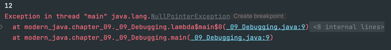
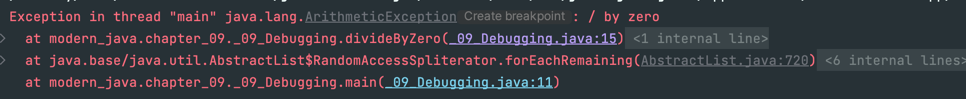

# 디버깅
> 디버깅할 때, 개발자는 다음 두 가지를 가장 먼저 확인해야 한다.
> 1. 스택 트레이스
> 2. 로깅

하지만, 람다 표현식과 스트림은 기존의 디버깅 기법을 무력화 한다.

## 람다와 스택 트레이스
- `stack frame` 
- `stack trace`


- `lambda$main$0`의 의미
  - 람다 표현식 내부에서 에러가 발생했음을 의미 
  - 여러 람다에서 예외가 터졌을땐 골치아플 것임 
  - 메서드 참조로 변경해도 정확한 정보는 나오지 않음


```java
public class _09_Debugging {
    public static void main(String[] args) {
        List<Integer> numbers = List.of(1, 2, 3, 4, 5);
        numbers.stream().map(_09_Debugging::divideByZero).forEach(System.out::println);
    }

    public static int divideByZero(int n) {
        return n / 0;
    }
}
```


- 다만, 자기 자신의 메서드를 이용한 메서드 참조에서 예외가 터진 경우에는 위와 같이 정확한 정보를 확인할 수 있다.
- 이는 미래의 자바 컴파일러가 개선해야 한다고 책에 적혀있ㄷ..ㅏ

