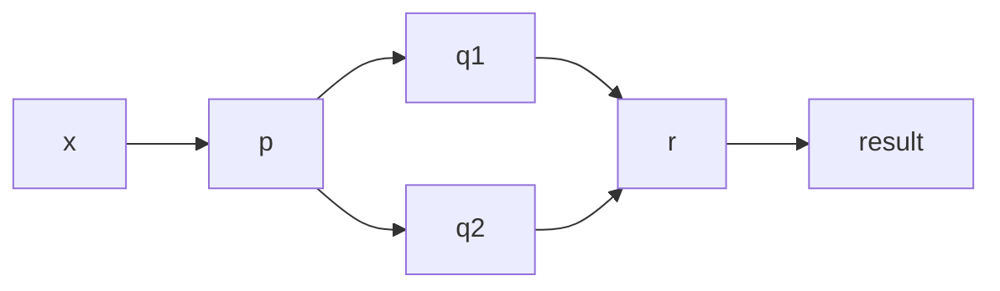

# 박스와 채널 모델 
- 동시성 모델을 잘 설계하고 개념화 하기 위한 모델 


간단한 박스와 채널 다이어그램이 있다. 이를 두 가지 방법으로 구현 해보자.

### 하드웨어 병렬성의 활용과 거리가 먼 방법 
```java
int t = p(x);
System.out.println( r(q1(t), q2(t)));
```


### Future를 이용해 f, g를 병렬로 평가하는 방법 
```java
int t = p(x);
Future<Integer> a1 = executorService.submit(() -> q1(t));
Future<Integer> a2 = executorService.submit(() -> q2(t));

System.out.println( r(a1.get(), a2.get()));
```
- 태스크가 많아진다면, 태스크가 get() 메서드를 호출해 Future가 끝나기를 기다리는 상태에 놓일 수도 있다 
  - 결과적으로 하드웨어 병렬성을 제대로 활용하지 못하거나, 심지어 데드락에 걸릴 수 있다. 


### CompletableFuture와 콤비네이터(Combinator)를 이용해 문제 해결
```java
// Function p, q1, q2
// BiFunction r
p.thenBoth(q1, q2)  // p 함수 실행 후 q1, q2 실행
    .thenCombine(r)  // 그 후 r 실행 
```