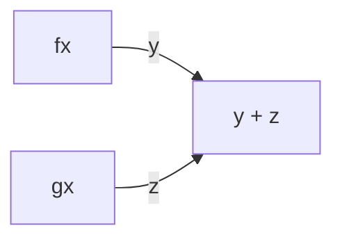

# CompletableFuture와 Combinator를 이용한 동시성
- Future를 조합할 수 있는 기능
- Future는 get으로 결과를 얻을 수 있는 Callable을 만듬
- CompletableFuture는 실행할 코드 없이 Future를 만들 수 있도록 허용함 
  - complete() : 나중에 어떤 값을 이용해 다른 스레드가 이를 완료할 수 있음
  - get() : 해당 값을 얻을 수 있음 

### thenCombine
- Future a, Future b의 결과를 알지 못한 상태에서, `thenCombine`은 두 연산이 끝났을 때 스레드 풀에서 실행된 연산을 만듬
  - 결과를 추가하는 세 번째 연산 c는 a, b 작업이 끝날 때 까지는 스레드에서 실행되지 않음
  - 게다가, 메서드 호출은 해둔 상태이기 때문에 블록이 되지 않는다. 

- f(x)와 g(x)가 끝난 후에야 덧셈 연산이 실행된다. 