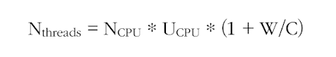

# 커스텀 Executor
## 풀에서 관리하는 스레드 수를 결정하는 방법
### 스레드 풀 크기 조절
- 스레드 풀이 너무 크면 CPU와 메모리 자원을 서로 경쟁하느라 시간을 낭비할 수 있음
- 스레드 풀이 너무 작으면 CPU 일부 코어는 활용되지 않을 수 있음

- 스레드 풀의 최적값을 찾는 방법

- Ncpu | Runtime.getRuntime().availableProcessors()가 반환하는 코어 수
- Ucpu | 0과 1 사이의 값을 갖는 CPU 활용 비율
- W/C  | 대기 시간과 계산 시간의 비율

- 스레드 수가 너무 많으면 오히려 서버가 크래시될 수 있으므로, 하나의 Excecutor에서 사용할 스레드의 최대 개수는 100 이하로 설정하는 것이 바람직하다.

## 스트림 병렬화 & CompletableFuture 병렬화 
컬렉션 계산을 병렬화 하는 두 가지 방법
- 병렬 스트림으로 변환하는 방법 
- 컬렉션 반복 -> CompletableFuture 내부의 연산으로 만드는 방법
  - 전체적인 계산이 블록되지 않도록 스레드 풀의 크기 조절 가능 

다음을 참고하면 병렬화 기법 사용 선택에 도움이 된다.
- I/O가 포함되지 않은 계산 중심의 동작을 실행할 때
  - 스트림 인터페이스가 가장 구현하기 간단하며 효율적일 수 있음. 
  - 모든 스레드가 계산 작업을 수행하는 상황에서는 프로세서 코어 수 이상의 스레드를 가질 필요 X

- 작업이 I/O를 기다리는 작업을 병렬로 실행할 때
  - CompletableFuture가 더 많은 유연성을 제공 
  - 대기/계산(W/C)의 비율에 적합한 스레드 수를 설정할 수 있음 
  - 스트림의 lazy evaluation -> 스트림에서 I/O를 실제로 언제 처리할지 예측하기 어려운 문제 
